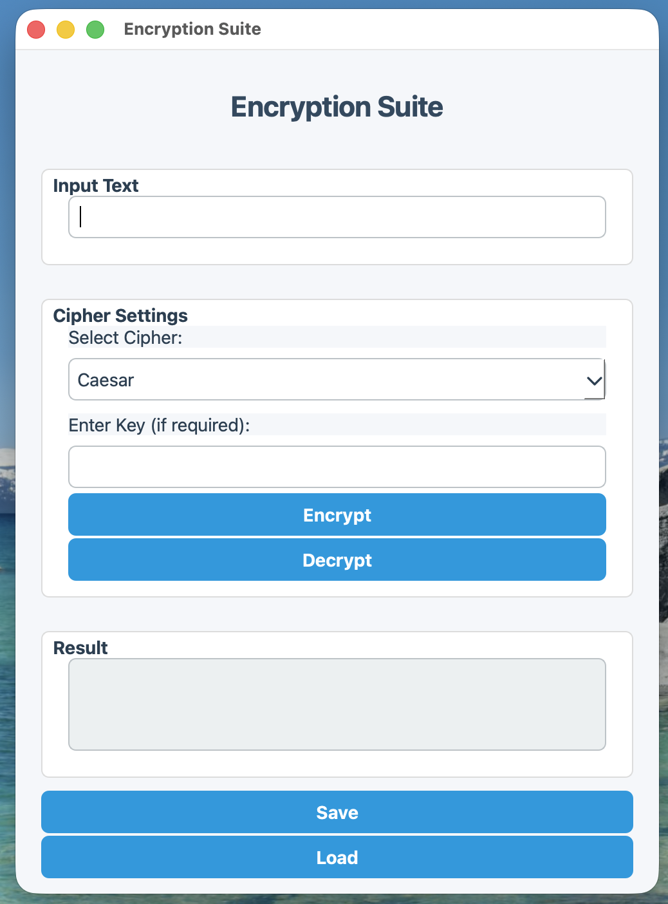
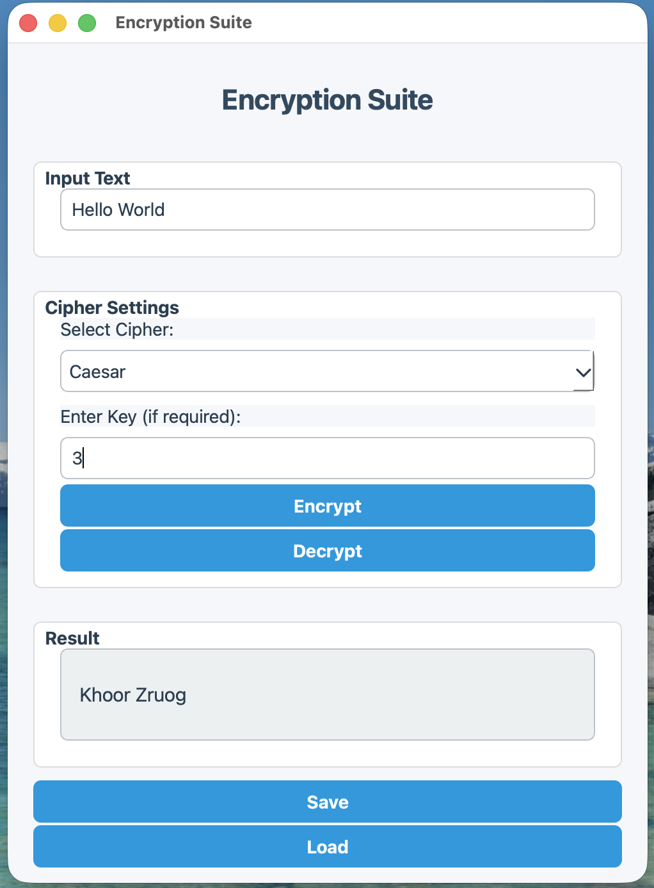
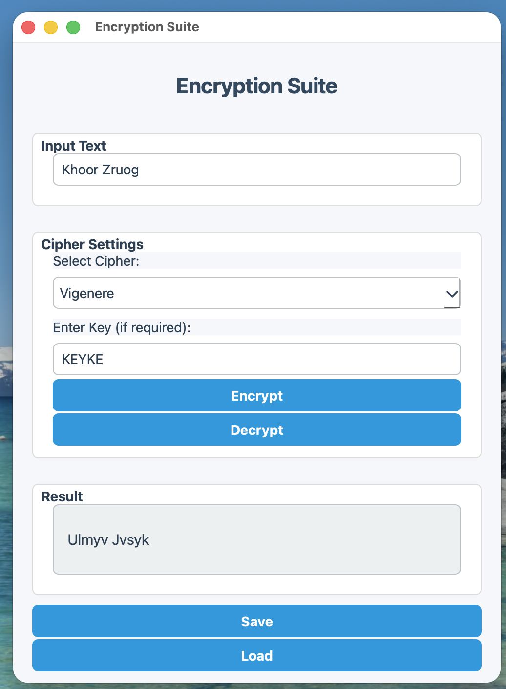

# 🔐 GUI-based Text Encryption & Decryption Suite

A desktop application developed using **C++ and Qt** that allows users to encrypt and decrypt text using six classical cryptographic algorithms through a graphical user interface.

The project demonstrates **Object-Oriented Programming (OOP)** concepts including abstraction, encapsulation, inheritance, polymorphism, and modular software design.

---

## 📅 Project Duration

**July 2025 – August 2025**

---

## 📌 Project Overview

The **GUI-based Text Encryption & Decryption Suite** provides a simple graphical interface where users can enter text, select an encryption method, provide the required key, and perform encryption or decryption.

The application supports six different classical cipher techniques and provides file input/output functionality for loading text and saving encrypted/decrypted results.

The GUI provides cipher selection, key input, encryption/decryption controls, result display, and file operations. 

---

# 🔐 Encryption Methods

## 1. Caesar Cipher

The Caesar Cipher is a substitution cipher that shifts each alphabetic character by a specified number of positions in the alphabet.

### Functionality

- Uses a **numeric shift key**.
- Supports both encryption and decryption.
- Uppercase and lowercase letters are preserved.
- Non-alphabetic characters remain unchanged.
- The shift wraps around the alphabet.

### Example

```text
Plaintext:  HELLO
Key:       3

Encrypted: KHOOR
```

### Decryption

The same shift is applied in the reverse direction to recover the original text.

---

## 2. Atbash Cipher

The Atbash Cipher replaces each letter with its corresponding letter from the reversed alphabet.

### Functionality

- Does not require a key.
- Maps letters using a reversed alphabet.
- Preserves uppercase and lowercase characters.
- Leaves numbers, spaces, and special characters unchanged.
- Encryption and decryption use the same transformation because Atbash is symmetric.

### Example

```text
Alphabet:

A B C D ... X Y Z
Z Y X W ... C B A

Plaintext:  HELLO
Encrypted: SVOOL
```

---

## 3. Vigenère Cipher

The Vigenère Cipher is a polyalphabetic substitution cipher that uses a repeating keyword to determine the character shifts.

### Functionality

- Uses a **text-based keyword**.
- The keyword is repeated across the plaintext.
- Each alphabetic character is shifted according to the corresponding keyword character.
- Non-alphabetic characters are preserved.
- Supports both encryption and decryption.

### Example

```text
Plaintext: HELLO
Key:       KEYKE

Encrypted: RIJVS
```

The keyword continues cycling when the plaintext is longer than the key.

---

## 4. Simple Substitution Cipher

The Simple Substitution Cipher replaces every letter of the alphabet with a corresponding letter from a user-provided substitution alphabet.

### Functionality

- Requires a **26-character substitution key**.
- Creates an encryption mapping from the standard alphabet to the supplied key.
- Creates a reverse mapping for decryption.
- Preserves uppercase/lowercase formatting.
- Leaves non-alphabetic characters unchanged.
- Validates that the substitution key contains exactly 26 characters.

### Example

```text
Normal Alphabet:
ABCDEFGHIJKLMNOPQRSTUVWXYZ

Substitution Key:
QWERTYUIOPASDFGHJKLZXCVBNM
```

Each plaintext letter is replaced using the corresponding position in the substitution key.

---

## 5. Columnar Transposition Cipher

The Columnar Transposition Cipher encrypts text by arranging it into columns and reading the columns according to the alphabetical order of the supplied keyword.

### Functionality

- Uses a **text-based key**.
- Determines the order of columns based on the key.
- Places plaintext into rows.
- Reads the columns according to the calculated key order.
- Adds `X` characters as padding when required.
- Supports both encryption and decryption.

### Example Concept

```text
KEYWORD

Text is arranged into columns:

K E Y W O R D
T H I S I S A
S A M P L E X

Columns are then read according to the
alphabetical order of the key.
```

The decryption process reconstructs the column arrangement to recover the original text.

---

## 6. XOR Cipher

The XOR Cipher applies a **bitwise XOR operation** between each character of the input text and a key character.

### Functionality

- Uses a numeric or single-character key.
- Applies XOR to each character.
- Encryption and decryption use the same operation.
- XOR is reversible when the same key is applied again.

### Example

```text
Plaintext
    ↓
XOR with Key
    ↓
Ciphertext
    ↓
XOR with Same Key
    ↓
Original Plaintext
```

Because XOR is symmetric:

```text
(A XOR B) XOR B = A
```

---

# ✨ Application Features

- 🔒 Text encryption
- 🔓 Text decryption
- 🔑 Multiple key types depending on the selected cipher
- 🔄 Six classical encryption algorithms
- 🖥️ Graphical User Interface
- 📂 Load text from files
- 💾 Save encrypted/decrypted results
- ⚠️ Input validation
- ❌ Error messages for invalid keys
- 🧩 Modular Object-Oriented design

The GUI provides controls for selecting the cipher, entering the required key, encrypting/decrypting, and saving or loading text. 

---

# 🧩 Object-Oriented Programming

The project applies several core OOP concepts.

### Abstraction

A common abstract `Cipher` interface defines:

```cpp
encrypt()
decrypt()
```

This provides a common structure for all cipher implementations.

### Inheritance

Each cipher is implemented as a separate class derived from the common `Cipher` abstraction.

### Polymorphism

The application can work with different cipher implementations through the common `Cipher` interface.

### Encapsulation

Cipher-specific data and functionality are contained within their respective classes.

### Composition

The application components work together through classes such as the cipher factory and GUI application components.

---

# 🏗️ Architecture

The application follows a modular design:

```text
                   ┌──────────────────────┐
                   │      Qt GUI          │
                   │    AppWindow         │
                   └──────────┬───────────┘
                              │
                              ▼
                   ┌──────────────────────┐
                   │    CipherFactory     │
                   │  Selects Cipher      │
                   └──────────┬───────────┘
                              │
             ┌────────────────┼─────────────────┐
             │                │                 │
             ▼                ▼                 ▼
       ┌──────────┐     ┌──────────┐     ┌──────────────┐
       │  Caesar  │     │  Atbash  │     │  Vigenère    │
       └──────────┘     └──────────┘     └──────────────┘
             │                │                 │
             ├────────────────┼─────────────────┤
             │                │                 │
             ▼                ▼                 ▼
       ┌──────────┐     ┌──────────┐     ┌──────────────┐
       │Substitute│     │ Columnar │     │     XOR      │
       └──────────┘     └──────────┘     └──────────────┘
                              │
                              ▼
                    ┌──────────────────┐
                    │ Encryption /     │
                    │ Decryption Result │
                    └──────────────────┘
```

---

# 🛠️ Technologies Used

| Technology | Purpose |
|---|---|
| **C++** | Core application development |
| **Qt 6** | Graphical User Interface |
| **CMake** | Build and project configuration |
| **Git** | Version control |
| **GitHub** | Source code management |

---

# 📁 Project Structure

```text
GUI-Text-Encryption-Decryption-Suite
│
├── cmake/
│   └── FindWrapOpenGL.cmake
│
├── include/
│   ├── AtbashCipher.h
│   ├── CaesarCipher.h
│   ├── Cipher.h
│   ├── CipherFactory.h
│   ├── ColumnarTranspositionCipher.h
│   ├── SimpleSubstitutionCipher.h
│   ├── VigenereCipher.h
│   └── XorCipher.h
│
├── src/
│   ├── AppWindow.cpp
│   ├── AtbashCipher.cpp
│   ├── CaesarCipher.cpp
│   ├── CipherFactory.cpp
│   ├── ColumnarTranspositionCipher.cpp
│   ├── SimpleSubstitutionCipher.cpp
│   ├── VigenereCipher.cpp
│   ├── XorCipher.cpp
│   └── main.cpp
│
├── CMakeLists.txt
├── .gitignore
└── README.md
```

---

# 🚀 Getting Started

## Prerequisites

Before building the application, install:

- C++17 compatible compiler
- Qt 6
- CMake
- Git

## Clone the Repository

```bash
git clone https://github.com/BinadiSilva/GUI-Text-Encryption-Decryption-Suite.git
```

Navigate to the project:

```bash
cd GUI-Text-Encryption-Decryption-Suite
```

## Build

Create a build directory:

```bash
cmake -S . -B build
```

Build the application:

```bash
cmake --build build
```

## Run

On macOS:

```bash
./build/EncryptionSuite
```

---

# 📸 Screenshots

Screenshots of the application will be added here.

### Main Interface



### Encryption



### Decryption



---

# 🎓 Learning Outcomes

Through this project, I gained practical experience in:

- C++ application development
- Qt GUI development
- Object-Oriented Programming
- Classical cryptography
- Encryption and decryption algorithms
- File handling
- Input validation
- Modular software design
- CMake
- Git and GitHub

---

# 🔮 Future Improvements

Possible future improvements include:

- Support for modern cryptographic algorithms such as AES and RSA
- Improved GUI/UX
- Drag-and-drop file encryption
- Encryption of complete files
- Improved key management
- Dark mode
- Additional cipher algorithms
- Improved cross-platform support

---

# 👩‍💻 Author

**Binadi Silva**

GitHub:  
https://github.com/BinadiSilva

LinkedIn:  
https://www.linkedin.com/

---

# 📄 License

This project was developed for educational and portfolio purposes.